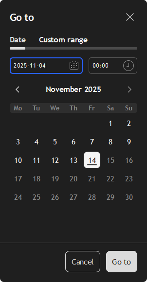
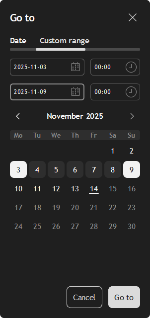
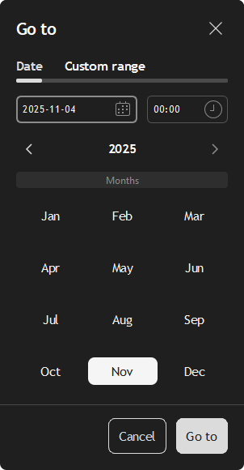
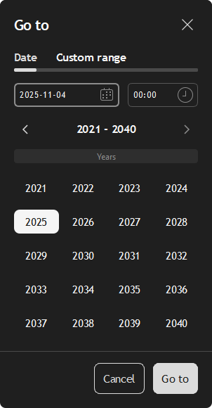

# Date Range Popover

I built this PyQt6 popover because I wanted a compact date and range picker I could drop into desktop tools without rewriting the same scaffolding each time.

## What you get

- `DateRangePopover` exposes top-level Qt signals (`date_selected`, `range_selected`, `cancelled`) so you can wire business logic without spelunking through widgets.
- `DatePickerConfig` centralizes options: picker mode, sizing, initial date or range, theming, and the new `min_date`/`max_date` bounds.
- A consistent style system driven by `ColorPalette`, `LayoutConfig`, and `StyleRegistry`, plus keyboard-friendly focus handling and track animations.
- A runnable demo under `examples/basic_popover_demo.py` that mirrors the code shown below.

## UI preview

Here are a few of the core views you get out of the box:

| Day view | Custom range |
| --- | --- |
|  |  |

| Month view | Year view |
| --- | --- |
|  |  |

## Install

```bash
# editable install while iterating
pip install -e .

# once you publish, pip can install it by name
pip install valgo-date-range-popover
```

Everything comes from the `pyproject.toml` (PEP 621 via hatchling), so `pip`, `python -m build`, or `hatch build` all work. The repo URL is `https://github.com/Taitranz/pyqt6-date-range-popover`.

## Run the demo

```bash
python -m examples.basic_popover_demo
```

That script opens a centered popover, prints selected dates/ranges to stdout, and shows how the signals behave. I often duplicate that module when testing different configs.

## Automated tests

```bash
pip install -e .[test]
pytest --maxfail=1 --disable-warnings --cov=date_range_popover
```

- `pytest.ini` keeps discovery strict (`testpaths`, strict markers) so widget regressions surface quickly.
- `tests/conftest.py` forces `QT_QPA_PLATFORM=offscreen` before Qt spins up, so the suite runs fine without an X server.
- `pytest-qt` drives widget-level tests via the built-in `qtbot` fixture while session-scoped `QApplication` setup also lives in `tests/conftest.py`.
- CI or local scripts can reuse the same command; coverage is optional but helpful for spotting regressions in the state manager/validation helpers.

## Embed it in your app

```python
from PyQt6.QtWidgets import QApplication
from date_range_popover import DatePickerConfig, DateRangePopover, PickerMode

app = QApplication([])
config = DatePickerConfig(
    mode=PickerMode.DATE,
    initial_date=None,
    min_date=None,
    max_date=None,
    time_step_minutes=15,
)
popover = DateRangePopover(config=config)
popover.date_selected.connect(lambda date: print(date.toString("yyyy-MM-dd")))
popover.show()
app.exec()
```

### Reading selection state

The picker now exposes `selected_date` and `selected_range` properties for
quick inspections (instead of `get_*` methods). Each access returns a fresh
`QDate`/`DateRange`, so you can safely cache the value:

```python
if popover.selected_range.end_date is not None:
    print("Range locked in:", popover.selected_range)
```

### Signals

- `date_selected(QDate)`: fires when a single date is locked in.
- `range_selected(DateRange)`: fires once both endpoints exist.
- `cancelled()`: fires when the user closes or cancels the popover.

### Configuration highlights

`DatePickerConfig` lets me keep behavior predictable:

- `mode`: `PickerMode.DATE` or `PickerMode.CUSTOM_RANGE`.
- `initial_date` / `initial_range`: seed selections on open.
- `width` / `height`: clamp popover bounds.
- `theme`: supply a custom `Theme`, `ColorPalette`, or `LayoutConfig`.
- `min_date` / `max_date`: block out-of-range navigation and selection. If you don't pass a `max_date`, it defaults to today's date so future days stay disabled (you can still opt-in to future dates by setting a later `max_date`).
- `time_step_minutes`: set the spacing for the time completer.

For heavier customization, import `date_range_popover.styles.theme` and build your own palette or layout before passing the theme into the config.

### Embedding & input sanitisation

- Configuration objects validate themselves in `__post_init__`, but you should still normalise user input before creating them.
- Reuse helpers from `date_range_popover.validation` (e.g. `validate_qdate`, `validate_date_range`, `validate_dimension`) to clamp untrusted values.
- Wrap config construction inside `try`/`except` blocks so you can surface informative errors or fall back to safe defaults.
- The demo under `examples/basic_popover_demo.py` mirrors the README examples and is safe to copy into your own app.

> Need more detail? See [`docs/embedding.md`](docs/embedding.md) for a longer end-to-end sanitisation guide.

### Theming notes

`StyleManager` pulls variants from `StyleRegistry`, so every component (calendar views, header, inputs, action buttons) calls into the same palette. Changing one palette entry gives you consistent colors, and swapping layout values adjusts spacing/geometry without touching the widgets.

## Upgrading

- `DateRangePicker.get_selected_date()` and `.get_selected_range()` were replaced with the property-based `selected_date` / `selected_range`. Update call sites to drop the `()` suffix.
- Docstrings and sanitisation guidance were expanded. Review the new `docs/embedding.md` file if you embed the widget inside a larger host.

## Packaging checklist

1. Increment the version in `pyproject.toml`.
2. `hatch build` or `python -m build` to create wheels/sdists.
3. `twine upload dist/*` to push to PyPI or TestPyPI.

The metadata already lists the license, authorship, and dependencies, so those commands are all you need when you decide to publish.

### Maintenance

This is a side project I built for my own tools, and my schedule is pretty full, so I do not expect to actively iterate on it. I may occasionally fix critical issues, but you should treat the API and behavior as "use at your own risk" and feel free to fork if you need faster changes. Some may recognise the design 😂.

## License

MIT License. See `LICENSE` for the exact terms.
